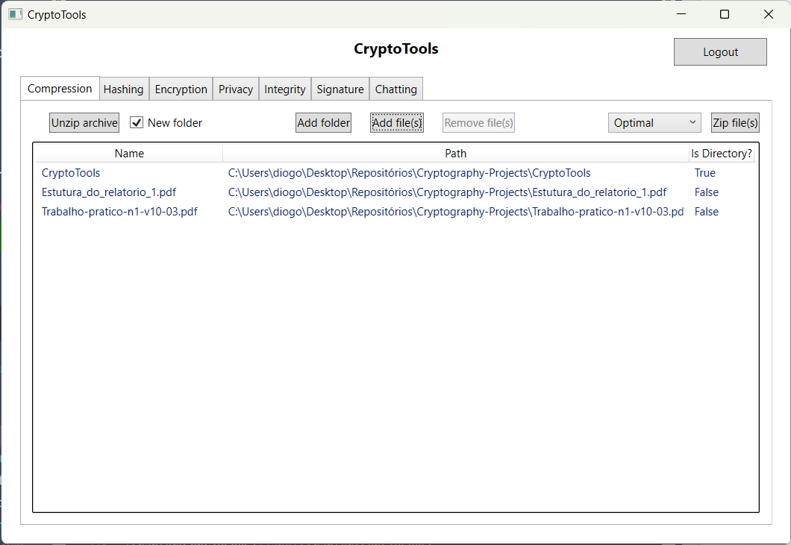
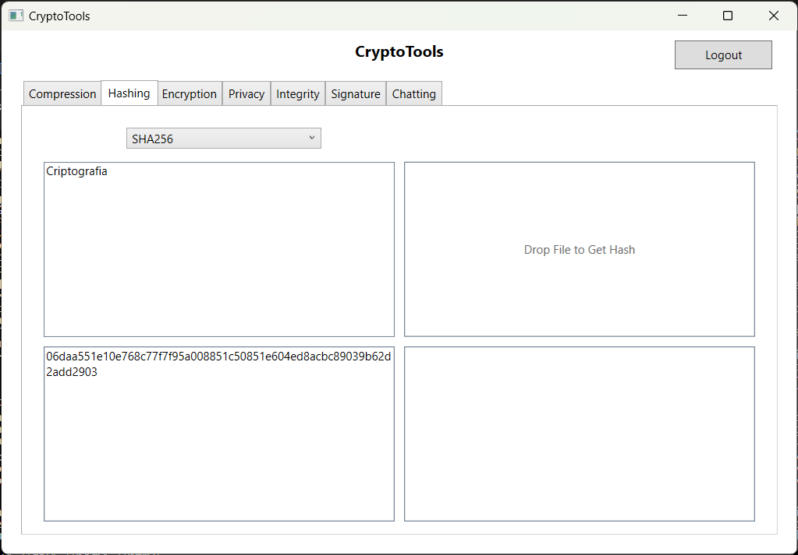
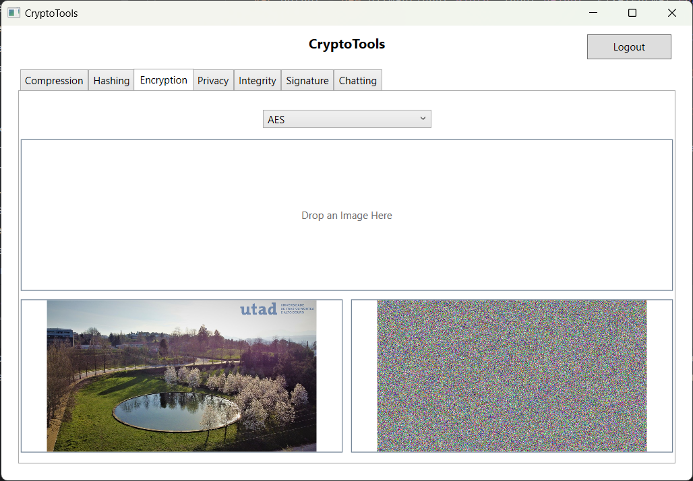
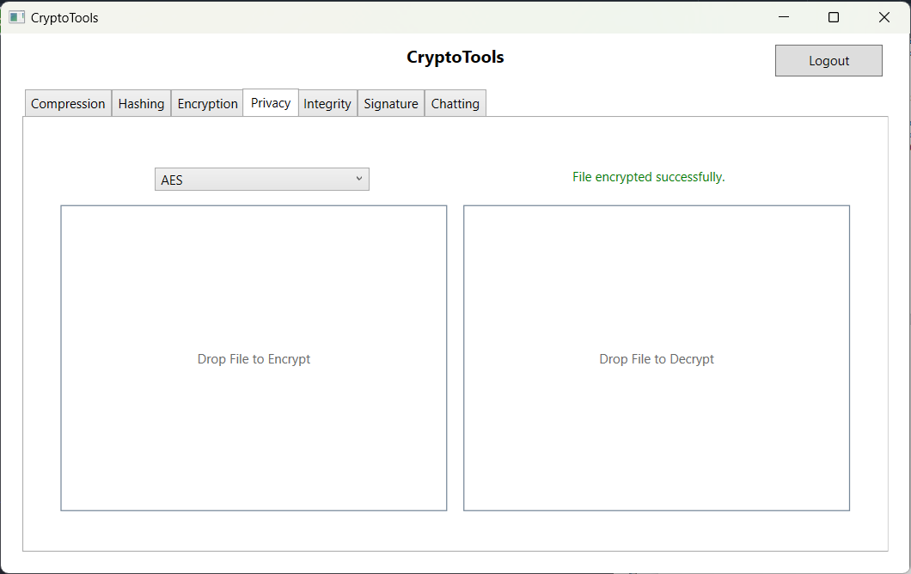
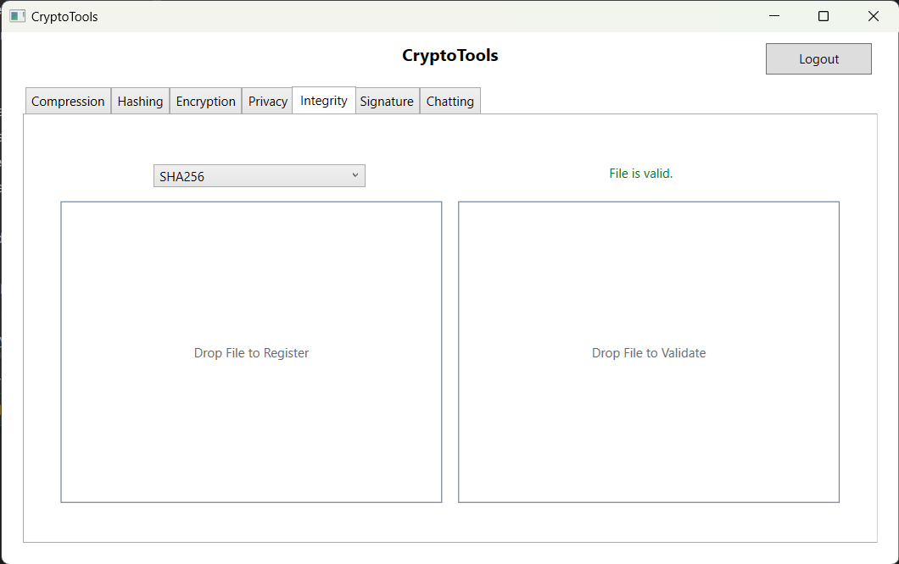
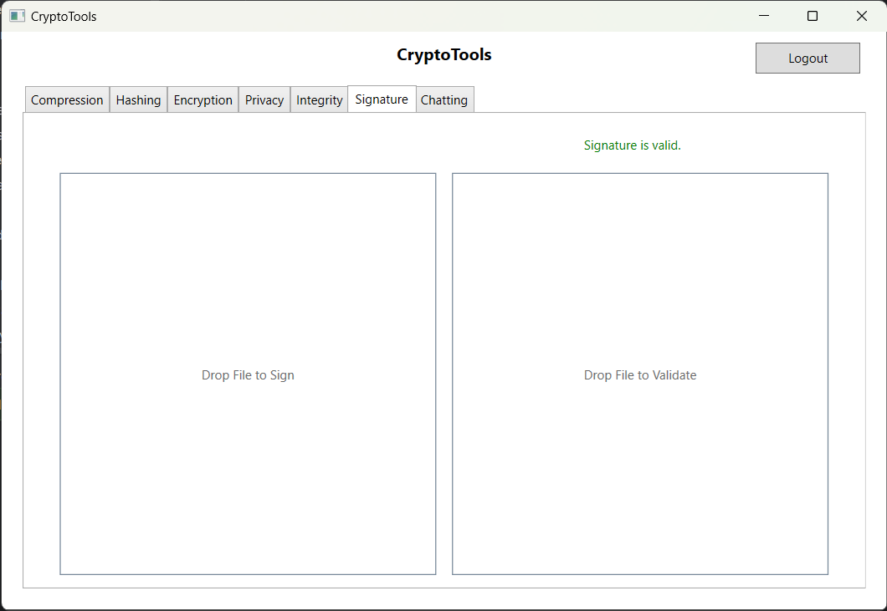
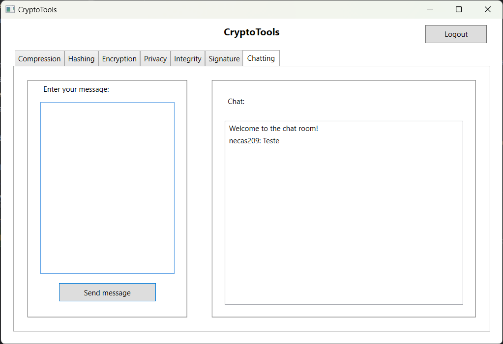

# CryptoTools

CryptoTools is a WPF application that offers a variety of tools for cryptography. It is written in C# and uses .NET 7.0.

The application is divided into 6 tabs:

- Zip: Compression and decompression of ZIP files
- Hashing: Hashing of text and files using MD5, SHA1, SHA256, SHA384, SHA512
- Encryption: Visualization of encrypted and decrypted images
- Privacy: Encryption and decryption of files using AES, DES, TripleDES, RC2, and RSA
- Integrity: File integrity checking using MD5, SHA1, SHA256, SHA384, SHA512
- Signature: Digital signature creation and verification using AES, DES, TripleDES, RC2, and RSA
- Chatting: A fully encrypted chatroom that uses AES for encryption, RSA for key exchange, and HMAC-SHA256 for message authentication

The solution contains 3 projects:

- CryptoTools: The main project that contains the user interface and the client-side logic
- CryptoServer: A server that handles the requests from the client and stores the data in a database
- CryptoLib: A library that contains the logic for cryptography and database operations, as well as the models for the database

## Table of Contents

- [CryptoTools](#cryptotools)
  - [Table of Contents](#table-of-contents)
  - [Getting Started](#getting-started)
    - [Prerequisites](#prerequisites)
    - [Installation](#installation)
  - [Building](#building)
  - [Usage](#usage)
    - [Compression and Decompression](#compression-and-decompression)
    - [Hashing](#hashing)
    - [Image Encryption and Decryption](#image-encryption-and-decryption)
    - [File Encryption and Decryption](#file-encryption-and-decryption)
    - [File Integrity Checking](#file-integrity-checking)
    - [Digital Signature Creation and Verification](#digital-signature-creation-and-verification)
    - [Chatroom](#chatroom)
  - [License](#license)
  - [Acknowledgments](#acknowledgments)
  - [Contact](#contact)
  - [Disclaimer](#disclaimer)
  - [Screenshots](#screenshots)

## Getting Started

These instructions will get you a copy of the project up and running on your local machine for development and testing purposes.

### Prerequisites

- [.NET 7.0](https://dotnet.microsoft.com/download/dotnet/7.0) or later
- [Visual Studio 2022](https://visualstudio.microsoft.com/vs/) or later
- As an alternative to Visual Studio, [JetBrains Rider](https://www.jetbrains.com/rider/) or [Visual Studio Code](https://code.visualstudio.com/) can be used

### Installation

1. Download the latest release from the [releases page]()
2. Extract the zip file
3. Run CryptoTools.exe
4. A "Login" window will appear. The user can either login or register a new account
5. After logging in, the main window will appear

## Building

1. Clone the repository
2. Open the solution in Visual Studio 2022 or later, JetBrains Rider, or Visual Studio Code
3. Build the "CryptoTools" project

## Usage

### Compression and Decompression

1. Click the "Zip" tab
2. Click "Add folder" or "Add file" to add files or folders to the list
3. Click "Zip" to create a zip file
4. Click "Unzip" to extract a zip file

### Hashing

1. Click the "Hashing" tab
2. Select the hashing algorithm
3. Enter the text or select the file to hash

### Image Encryption and Decryption

1. Click the "Encryption" tab
2. Select the encryption algorithm
3. Select or drag and drop an image file
4. View the encrypted image

### File Encryption and Decryption

1. Click the "Privacy" tab
2. Select the encryption algorithm
3. Select or drag and drop a file to encrypt
4. A file with the same name and the extension ".enc" will be created
5. To decrypt the file, select the decryption algorithm and select or drag and drop the encrypted file

### File Integrity Checking

1. Click the "Integrity" tab
2. Select the hashing algorithm
3. Select or drag and drop a file to hash
4. An entry will be added to the server database
5. To check the integrity of the file, select the hashing algorithm and select or drag and drop the file
6. The result will be displayed (valid or invalid)

### Digital Signature Creation and Verification

1. Click the "Signature" tab
2. Select or drag and drop a file to sign
3. A file with the same name and the extension ".sign" will be created
4. To verify the signature, select or drag and drop the signed file
5. The result will be displayed (valid or invalid)

### Chatroom

1. Click the "Chatting" tab
2. A message from the server will appear in the chat window
3. Enter a message in the text box and press enter to send the message
4. The message will be encrypted and sent to the server
5. The server will decrypt the message and send it to all clients
6. The message will be displayed in the chat window

## License

This project is licensed under the MIT License - see the [LICENSE.md](LICENSE) file for details.

## Acknowledgments

- [Stack Overflow](https://stackoverflow.com/)
- [Microsoft Docs](https://docs.microsoft.com/en-us/)

## Contact

- Diogo Medeiros - [Email](mailto:diogo_medeiros@sapo.pt)
- Tomás Silva - [Email](mailto:tomascsilvapro@gmail.com)

## Disclaimer

This project is for educational purposes only. The authors are not responsible for any misuse of the application.

## Screenshots

